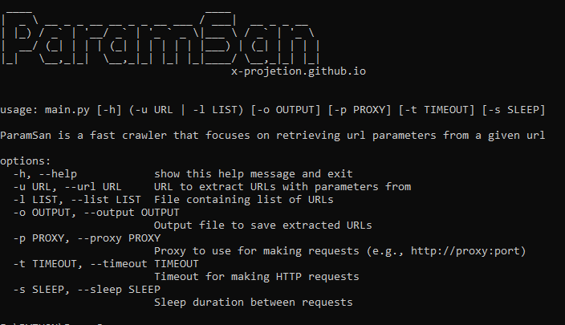

<h1 align="center">
  
  <br>
</h1>

<h4 align="center">Crawling URL parameters</h4>

# ParamSan
ParamSan is a tool for searching URL parameters on a website.

## Installation
```
git clone github.com/X-Projetion/ParamSan/
```

## Usage

```
main.py -h

ParamSan is a fast crawler that focuses on retrieving url parameters from a given url

options:
  -h, --help            show this help message and exit
  -u URL, --url URL     URL to extract URLs with parameters from
  -l LIST, --list LIST  File containing list of URLs
  -o OUTPUT, --output OUTPUT
                        Output file to save extracted URLs
  -p PROXY, --proxy PROXY
                        Proxy to use for making requests (e.g., http://proxy:port)
  -t TIMEOUT, --timeout TIMEOUT
                        Timeout for making HTTP requests
  -s SLEEP, --sleep SLEEP
                        Sleep duration between requests
```

#Running
ParamSan requires a url or endpoint to crawl and accept one or more inputs.
Input URLs can be given using the -u option, and multiple values ​​can be given using comma separated input, similarly file input is supported using the -l option.

#Input URL

main.py -u https://x-projetion.github.io/

#Input List 
main.py -l list.txt

<center>ParamSan Made in ❤️ By Lutfifakee</center>
$nano
https://x-projetion.github.io/
youtube.com
google.com
